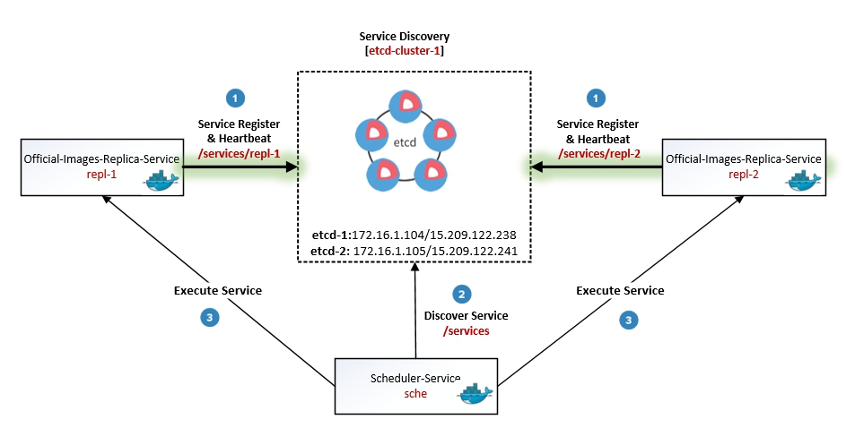

# Service Discovery Flow


# Mircoservice Architecture
## repl mircoservice
The microservice repl replicates the official images from docker hub to your enterprise private registry to keep images fetch traffic on local network.

## sche mircoservice
The microservice sche will be scheduled to discover repl services registed in global service discovery server. Once the services are found, it will execute them with additional load balance and routing algorithms.

# Setup
## Install etcd
```
curl -L  https://github.com/coreos/etcd/releases/download/v2.2.0/etcd-v2.2.0-linux-amd64.tar.gz -o etcd-v2.2.0-linux-amd64.tar.gz
tar xzvf etcd-v2.2.0-linux-amd64.tar.gz
```
## Setup etcd cluster
```
etcd -name infra0 -initial-advertise-peer-urls http://172.16.1.104:2380 \
 -listen-peer-urls http://172.16.1.104:2380 \
 -listen-client-urls http://0.0.0.0:2379 \
 -advertise-client-urls http://0.0.0.0:2379 \
 -initial-cluster-token etcd-cluster-1 \
 -initial-cluster infra0=http://172.16.1.104:2380,infra1=http://172.16.1.105:2380 \
 -initial-cluster-state new

 etcd -name infra1 -initial-advertise-peer-urls http://172.16.1.105:2380 \
  -listen-peer-urls http://172.16.1.105:2380 \
  -listen-client-urls http://0.0.0.0:2379 \
  -advertise-client-urls http://0.0.0.0:2379 \
  -initial-cluster-token etcd-cluster-1 \
  -initial-cluster infra0=http://172.16.1.104:2380,infra1=http://172.16.1.105:2380 \
  -initial-cluster-state new
```

## Start containers
`docker-compose up`
